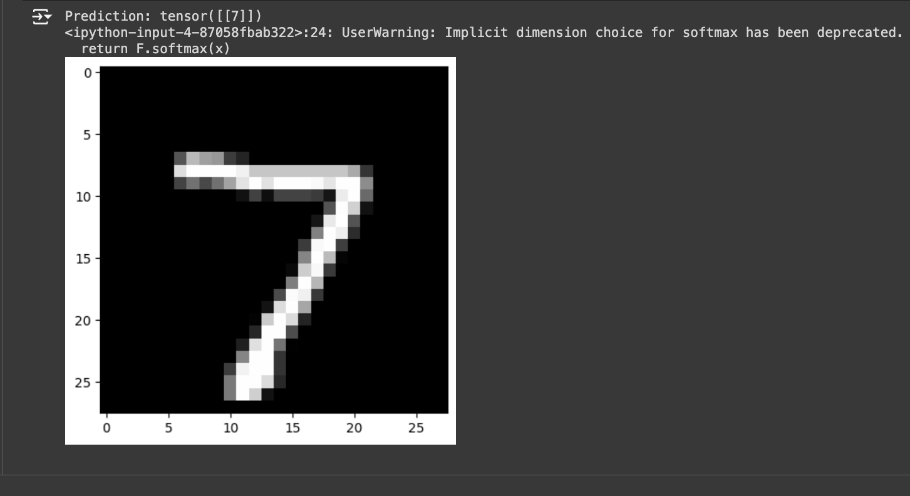

# MNIST Classifier
Authors: \<[Joshua Ha](https://github.com/UserIsBlank)\>
> This project implements a neural network to classify handwritten digits from the MNIST dataset. The goal of the classifier is to achieve high accuracy on the MNIST dataset, serving as a 
> fundamental exercise in computer vision and deep learning. The project is implemented in Python, with the model training and evaluation performed in Jupyter Notebook.
## Introduction
> The MNIST dataset is a widely used benchmark in machine learning, particularly for handwritten digit recognition. This project trains a neural network to classify digits from this dataset with 
> high accuracy. The notebook contains steps for loading the data, preprocessing, model training, and evaluation.
## Installation Dependencies
> To run this project, you will need Python and the following libraries:
> * PyTorch
> * matplotlib
## Screenshots
> 
